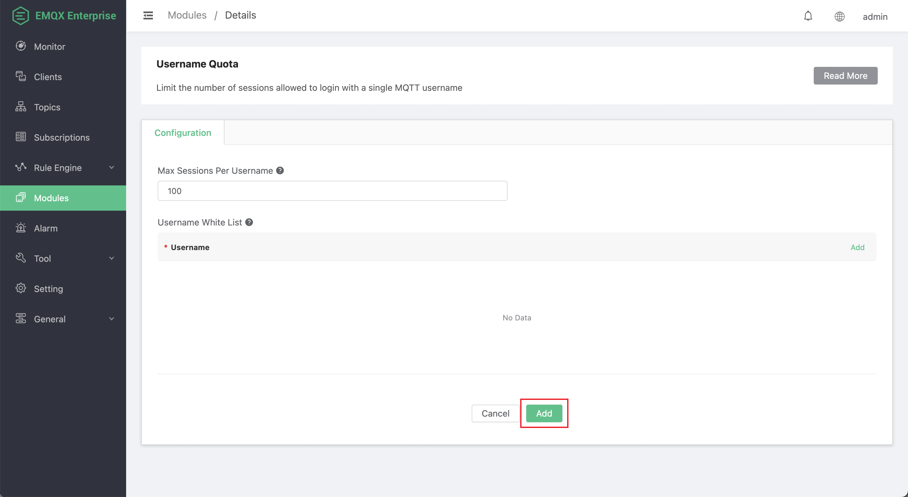

# Username Quota

Starting from version 4.4.25, a new username quota module has been added to limit the maximum number of sessions for a single MQTT username.

When a username exceeds the quota, new sessions will be refused connection, with a CONNACK return code of "0x97 Quota Exceeded" (MQTT 5.0) or "0x03 Service Unavailable" (MQTT 3.1.1).

## Creating the Module

1. Open the [EMQX Dashboard](http://127.0.0.1:18083/#/modules), click on the "Modules" tab on the left, and select "Add Module".

2. Select the "Username Quota" module, configure the relevant parameters, and then click "Add".

   

## Parameter Settings

The username quota module supports the following parameters:

- **Max Sessions Per Username**: Specifies the maximum number of MQTT sessions allowed for each username. Note that if the MQTT client logs in using a persistent session, the session will remain on the server even after the client disconnects, until the session expires and is cleared.

- **Username White List**: You can add whitelisted usernames using the "Add" button on the right. Usernames in the whitelist are not subject to session limits. For example, if you need to allow MQTT bridge clients connecting to this cluster to bypass the quota limitation, you can add the usernames used by the MQTT bridge to the whitelist.

## Usage Example

1. Open the [EMQX Dashboard](http://127.0.0.1:18083/#/modules), click on the "Modules" tab on the left, and click on the "Username Quota" module that we have already added.

2. On the "Usage" page, you can see the current usernames in the EMQX cluster and the number of sessions for each username. Click the "View" button next to the session count to view the session list for the current username.

   
