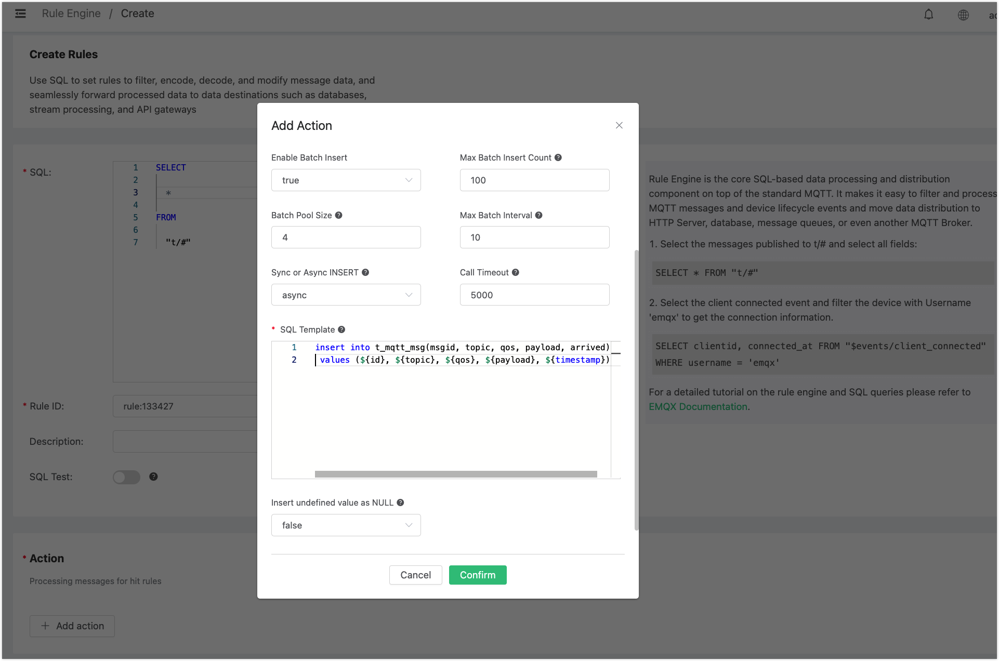

# Ingest Data into Cassandra

Set up a Cassandra database. Change the root/password to root/public. The following code example takes Mac OSX for instance:

```bash
$ brew install cassandra

## change the config file to enable authentication
$  vim /usr/local/etc/cassandra/cassandra.yaml

    authenticator: PasswordAuthenticator
    authorizer: CassandraAuthorizer

$ brew services start cassandra

## login to cql shell and then create the root user
$ cqlsh -ucassandra -pcassandra

cassandra@cqlsh> create user root with password 'public' superuser;
```

Initiate Cassandra Table:

```bash
$ cqlsh -uroot -ppublic
```

Create Keyspace "test":

```sql
CREATE KEYSPACE test WITH replication = {'class': 'SimpleStrategy', 'replication_factor': '1'}  AND durable_writes = true;
```

Create "t_mqtt_msg" table:

```bash
USE test;

CREATE TABLE t_mqtt_msg (
    msgid text,
    topic text,
    qos int,
    payload text,
    arrived timestamp,
    PRIMARY KEY (msgid, topic)
);
```

Create a rule:

Go to [EMQX Dashboard](http://127.0.0.1:18083/#/rules), and select the "rule" tab on the menu to the left.

Select "message.publish", then type in the following SQL:

```sql
SELECT
    *
FROM
    "t/#"
```


Bind an action:

Click the "+ Add action" button under "Action". In the pop-up dialog window, select "Data persist" from the drop-down list of "Action Type" and select "Data to Cassandra".


Fill in the parameters required by the action:

Two parameters are required by action "Data to Cassandra":

1). SQL template. SQL template is the sql command you'd like to run when the action is triggered. In this example, we'll insert a message into Cassandra, so type in the following sql template:

```sql
insert into t_mqtt_msg(msgid, topic, qos, payload, arrived) values (${id}, ${topic}, ${qos}, ${payload}, ${timestamp})
```

Before data is inserted into the table, placeholders like \${key} will be replaced by the corresponding values. 

If a placeholder variable is undefined, you can use the **Insert undefined value as Null** option to define the rule engine behavior:

- `false` (default): The rule engine can insert the string `undefined` into the database.
- `true`: Allow the rule engine to insert `NULL` into the database when a variable is undefined.



2). Bind a resource to the action. Since the drop-down list "Resource" is empty for now, we create a new resource by clicking on "Create" at the top right:


Configure the resource:

Set "Cassandra Keyspace" to "test", "Cassandra Username" to "root", "Cassandra Password" to "public", and keep all other configs as default, and click on the "Testing Connection" button to make sure the connection can be created successfully.


Then click on the "Confirm" button.

Back to the "Actions" dialog, and then click on the "Confirm" button.


Back to the creating rule page, then click on the "Create" button. The rule we created will be shown in the rule list:


We have finished, testing the rule by sending an MQTT message to emqx:

```bash
> Topic: "t/cass"
> QoS: 1
> Retained: true
> Payload: "hello"
```
Then inspect the Cassandra table, and verify a new record has been inserted:


From the rule list, verify that the "Matched" column has increased to 1:


