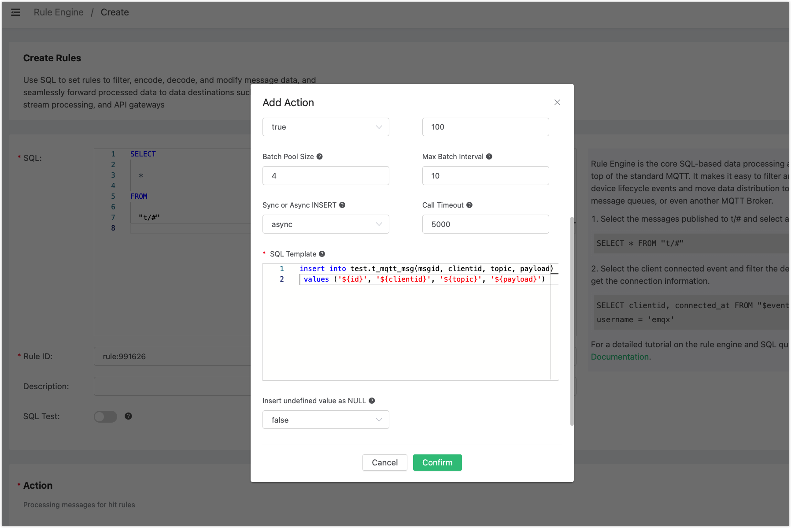

# Ingest Data into ClickHouse

Steup the ClickHouse database, and set username/password to default/public. Taking CentOS as example:

```bash
## install dependencies
sudo yum install -y epel-release

## download and run the installation script provided by packagecloud.io
curl -s https://packagecloud.io/install/repositories/altinity/clickhouse/script.rpm.sh | sudo bash

## install ClickHouse server and client
sudo yum install -y clickhouse-server clickhouse-client

## start the ClickHouse server
clickhouse-server

## start the ClickHouse client
clickhouse-client
```

Create the `test` database:
```sql
create database test;
```
create `t_mqtt_msg` table:

```sql
use test;
create table t_mqtt_msg (msgid Nullable(String), topic Nullable(String), clientid Nullable(String), payload Nullable(String)) engine = Log;
```


**Create the rule:**

Go to the [EMQX Dashboard](http://127.0.0.1:18083/#/rules), and type in the follwing SQL:

```sql
SELECT * FROM "#"
```


**Select an action:**

Add an action and select "Data to ClickHouse" from the dropdown list.


Provide the arguments of the action:

1). The resource id. We create a new clickhouse resource now:

Click "create" right to the resource Id text box, and then select "clickhouse" and fill in the following paramenters:


Click the "Confirm" button.

2). The SQL template. In this example, we insert a message to ClickHouse:

```sql
insert into test.t_mqtt_msg(msgid, clientid, topic, payload) values ('${id}', '${clientid}', '${topic}', '${payload}')
```

Before data is inserted into the table, placeholders like \${id} will be replaced by the corresponding values. 

If a placeholder variable is undefined, you can use the **Insert undefined value as Null** option to define the rule engine behavior:

- `false` (default): The rule engine can insert the string `undefined` into the database.
- `true`: Allow the rule engine to insert `NULL` into the database when a variable is undefined.



Keep all other arguments unchanged and confirm the action creation.

Then click "Create" to confirm the rule creation.

Now the rule has been created, we send an testing message to the broker:

```bash
Topic: "t/a"
QoS: 1
Payload: "hello"
```

And then we can verify if the message is inserted to the clickhouse table:


