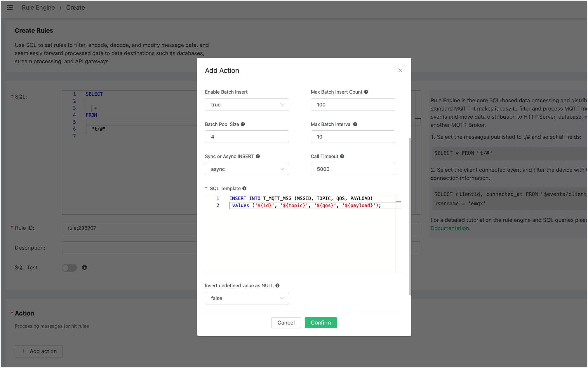
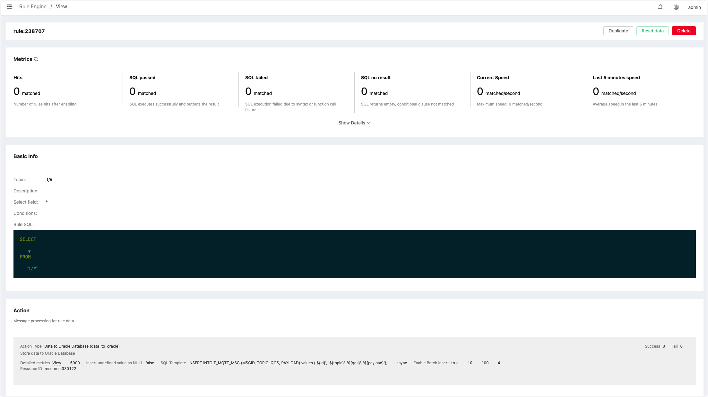

# Ingest Data into Oracle DB

Create t_mqtt_msg table:

```sql
CREATE TABLE t_mqtt_msg (msgid VARCHAR2(64),topic VARCHAR2(255), qos NUMBER(1), payload NCLOB)
```


Create rules:

Open [EMQX Dashboard](http://127.0.0.1:18083/#/rules) and select the "Rules" tab on the left.

Fill in the rule SQL:

```sql
SELECT * FROM "t/#"
```


Related actions:

In the "Action" interface, click "Add action", and then select "Data persist" -> "Data to Oracle Database" in the "Action Type" drop-down box.

Fill in the action parameters:

The "Save data to Oracle Database" action requires two parameters:

1). SQL template. In this example, we insert a piece of data into Oracle Database. The SQL template is:

```sql
INSERT INTO T_MQTT_MSG (MSGID, TOPIC, QOS, PAYLOAD) values ('${id}', '${topic}', '${qos}', '${payload}');
```

Before data is inserted into the table, placeholders like \${id} will be replaced by the corresponding values. 

If a placeholder variable is undefined, you can use the **Insert undefined value as Null** option to define the rule engine behavior:

- `false` (default): The rule engine can insert the string `undefined` into the database.
- `true`: Allow the rule engine to insert `NULL` into the database when a variable is undefined.



2). The ID of the associated resource. Now that the resource drop-down box is empty, and you can click "Create" in the upper right corner to create an Oracle Database resource:

Fill in the resource configuration:


Note: for the connection to Oracle Real Applications Cluster (RAC) to work properly, the "Service Name" field must be filled correctly.  If left empty, it defaults to the Database SID.

Click the "Test" button to make sure the connection can be created successfully, and then click the "Confirm" button.

Return to the Add Action dialogue and click "Confirm".

Return to the rule creation interface and click "Create".


In the rule list, click the rule ID to preview the rule just created:



The rule has been created. Now, send a piece of data:

```bash
Topic: "t/a"
QoS: 1
Payload: "hello"
```

View the number of rule hits


